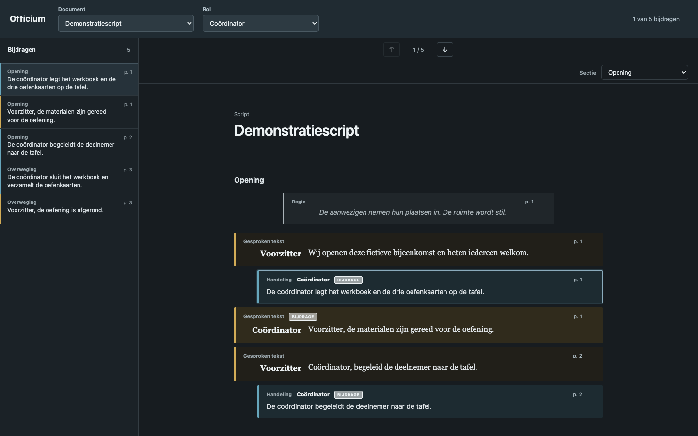

# Officium

Officium is a local reader for studying structured documents. It keeps the complete document visible while indexing and highlighting the spoken passages and assigned actions of a selected role. It also supports ordered study material made from explanatory text, prompts, and question-and-answer pairs.

The public repository contains the application, schema validator, tests, and fictional examples. Personal documents remain in an ignored local library and are never required to build the public application.



## Run

Install Node.js 24, then run:

```sh
npm install
npm run dev
```

Open the address printed by Vite. The browser version loads personal documents from `rituals/` when they exist and otherwise loads the fictional documents from `examples/rituals/`.

## Desktop application

Officium uses Tauri to build native applications for macOS, Windows, and Linux while retaining the Svelte interface. Install the current stable Rust toolchain and the platform prerequisites listed by Tauri, then run:

```sh
npm run tauri:dev
```

The first desktop launch opens a native directory picker. Select the local document-library directory. Officium remembers that directory for later launches. The `Bibliotheek` button selects a different directory, and source links open the corresponding PDF in the operating system's default application.

Build the public application without personal documents:

```sh
npm run tauri:build
```

Build a personal application containing the ignored local library:

```sh
npm run tauri:build:private
```

Bundled personal files are ordinary application resources and are not encrypted. Do not distribute a personal build. The public build never includes the local library.

Platform-specific configuration produces `.app` and `.dmg` bundles on macOS, NSIS and MSI installers on Windows, and AppImage, DEB, and RPM packages on Linux. `.github/workflows/desktop-build.yml` builds all three operating systems, including Apple Silicon and Intel macOS targets.

The workflow signs packages when the corresponding repository secrets exist and otherwise produces unsigned artifacts. Apple signing and notarization use `APPLE_CERTIFICATE`, `APPLE_CERTIFICATE_PASSWORD`, `APPLE_SIGNING_IDENTITY`, `APPLE_ID`, `APPLE_PASSWORD`, and `APPLE_TEAM_ID`. Windows Authenticode signing uses `WINDOWS_CERTIFICATE`, `WINDOWS_CERTIFICATE_PASSWORD`, and `WINDOWS_TIMESTAMP_URL`. Linux AppImage and RPM signing use `LINUX_GPG_PRIVATE_KEY`, `LINUX_GPG_KEY_ID`, and `LINUX_GPG_PASSPHRASE`. Signing credentials never belong in the repository.

## Publishing to a WordPress membership site (planned)

This section describes a planned feature that is not built yet. Officium would be shown on a WordPress site that uses the Simple Membership plugin, for logged-in members only. The login cookie of the site is sent only to the site's own host, so the library is served from the site itself and not from a subdomain or a separate Node server.

1. An export step on the author's machine loads the library with the existing validator and writes a catalogue file, the source PDFs, and the images to an output directory that Git ignores.
2. The author uploads that directory by SFTP to a directory that the web server does not serve to the public.
3. A WordPress plugin kept in this repository, without any library content, provides the catalogue, source PDF, answer image, and entry image endpoints. Each endpoint serves a file only to a logged-in Simple Membership member or to a WordPress administrator. The plugin can limit each document to specific membership levels.
4. A static build of the application, made with its own build mode, fetches the library from those endpoints. A shortcode shows the application in an iframe on a page of the member portal.

The exported library is private content and never belongs in Git. Members with a permitted level, WordPress administrators, and anyone with file access to the web host can read it.

## Add personal documents

Create `rituals/` at the repository root and put source PDFs in `rituals/sources/`. The whole `rituals/` directory is ignored by Git. The `source.file` and `answer_image` paths are relative to this directory and must remain inside it.

Use the fictional files under `examples/rituals/` as format references. Do not place personal content under `examples/` or another tracked directory.

When at least one valid document exists below `rituals/`, Officium shows only those personal documents. Without personal documents, it shows the fictional examples.

## YAML structure

Every selectable document is either one standalone YAML file or a directory containing a `document.yaml` manifest. A standalone file contains the complete document, including its sections. The directory format keeps document metadata in `document.yaml` and stores each section in a separate, semantically named file under `sections/`.

### Common document keys

| Key              | Required | Allowed value                                                                                      |
| ---------------- | -------- | -------------------------------------------------------------------------------------------------- |
| `schema_version` | Yes      | The integer `1`                                                                                    |
| `id`             | Yes      | A unique lowercase ASCII identifier containing letters, numbers, and single hyphens                |
| `order`          | Yes      | A positive integer that determines library position and is unique within the library               |
| `document_type`  | Yes      | `ritual` for a role-based script or `catechism` for question-and-answer study material             |
| `title`          | Yes      | The displayed document title                                                                       |
| `language`       | Yes      | A nonempty language identifier such as `en` or `nl`                                                |
| `source.file`    | Yes      | A relative `.pdf` path without `.` or `..` path segments                                           |
| `sections`       | Yes      | Inline section objects in a standalone file, or ordered section-file paths in a directory manifest |

The order of the `sections` list is the order shown by Officium. File names do not determine section order. A section-file path must have the form `sections/opening.yaml`, using a lowercase ASCII name made from letters, numbers, and hyphens.

### Role-based document directory

```text
rituals/
    sources/
        training-session.pdf
    training-session/
        document.yaml
        sections/
            preparation.yaml
            opening.yaml
            exercise.yaml
            closing.yaml
```

`rituals/training-session/document.yaml` contains the document metadata, roles, and ordered section paths:

```yaml
schema_version: 1
id: training-session
order: 10
document_type: ritual
title: Training Session
language: en
source:
    file: sources/training-session.pdf
sections:
    - sections/preparation.yaml
    - sections/opening.yaml
    - sections/exercise.yaml
    - sections/closing.yaml
roles:
    - id: chair
      label: Chair
    - id: coordinator
      label: Coordinator
```

Each role has these keys:

| Key     | Required | Allowed value                                                                       |
| ------- | -------- | ----------------------------------------------------------------------------------- |
| `id`    | Yes      | A unique lowercase ASCII identifier containing letters, numbers, and single hyphens |
| `label` | Yes      | The role name shown in the function selector                                        |

Every `speaker` and every item in `roles` on an action must refer to a role declared in the document manifest.

### Sections and entries

A role-based section file contains one section object:

```yaml
id: opening
title: Opening
entries:
    - id: opening-heading
      kind: text
      text: TRAINING SESSION
      source:
          pdf_page: 1
          printed_page: '1'
    - id: opening-direction
      kind: direction
      text: The room becomes quiet.
      source:
          pdf_page: 1
          printed_page: '1'
    - id: opening-action
      kind: action
      roles:
          - coordinator
      text: The coordinator places the training cards on the table.
      source:
          pdf_page: 1
          printed_page: '1'
    - id: opening-speech
      kind: speech
      speaker: chair
      text: The exercise begins.
      source:
          pdf_page: 1
          printed_page: '1'
```

Each section requires a unique `id`, a displayed `title`, and a nonempty ordered `entries` list.

| `kind`      | Purpose                                                                | Additional required keys                    | Appears in the selected-role index |
| ----------- | ---------------------------------------------------------------------- | ------------------------------------------- | ---------------------------------- |
| `speech`    | Words spoken by one role                                               | `speaker`                                   | Yes, for that speaker              |
| `action`    | An action assigned to one or more roles                                | `roles`, a nonempty list of unique role IDs | Yes, for every assigned role       |
| `direction` | A stage direction, atmosphere, music, lighting, or another instruction | None                                        | No                                 |
| `text`      | A source heading or explanatory passage                                | None                                        | No                                 |

Every entry also requires:

| Key                   | Required | Allowed value                                                       |
| --------------------- | -------- | ------------------------------------------------------------------- |
| `id`                  | Yes      | A document-wide unique lowercase ASCII identifier                   |
| `text`                | One of   | Nonempty source text                                                |
| `content`             | One of   | A nonempty ordered list of text and image parts                     |
| `source.pdf_page`     | Yes      | A positive integer containing the physical PDF page index           |
| `source.printed_page` | No       | A nonempty string containing the page label printed in the document |

Use exactly one of `text` or `content`. Use `text` for an entry containing only text. Use `content` when an illustration occurs before, between, or after pieces of text:

```yaml
content:
    - type: text
      text: First part of the instruction.
    - type: image
      file: assets/demonstration-symbol.png
      alt: Demonstration symbol
      display: inline
    - type: text
      text: Second part of the instruction.
```

Every content part has one of these forms:

| `type`  | Required keys                | Allowed values                                                                      |
| ------- | ---------------------------- | ----------------------------------------------------------------------------------- |
| `text`  | `text`                       | Nonempty source text                                                                |
| `image` | `file`, `alt`, and `display` | A relative PNG, JPEG, or WebP path, a nonempty description, and `inline` or `block` |

An entry using `content` must contain at least one text part. `inline` places the image in the text flow. `block` centers it on its own line. Image paths are relative to the selected library for personal documents and `examples/` for fictional documents.

A standalone role-based document uses the same section and entry objects inline.

### Question-and-answer blocks

A question-and-answer document normally fits in one standalone YAML file:

```yaml
schema_version: 1
id: review-questions
order: 20
document_type: catechism
title: Review Questions
language: en
source:
    file: sources/review-questions.pdf
sections:
    - id: review
      title: Review
      blocks:
          - id: introduction
            type: text
            text: Read the source before answering the questions.
            source:
                pdf_page: 1
                printed_page: '1'
          - id: preparation
            type: prompt
            text: Summarize the preceding section.
            source:
                pdf_page: 1
                printed_page: '1'
          - id: first-question
            type: pair
            question: Why is the complete document kept visible?
            answer: Because each contribution depends on its surrounding context.
            source:
                pdf_page: 1
                printed_page: '1'
          - id: illustrated-answer
            type: pair
            question: Identify the illustrated arrangement.
            answer_image: assets/arrangement.png
            source:
                pdf_page: 2
                printed_page: '2'
```

Each question-and-answer section requires a unique `id`, a displayed `title`, and a nonempty ordered `blocks` list.

| `type`   | Purpose                                       | Additional required keys                                 | Appears in the question index |
| -------- | --------------------------------------------- | -------------------------------------------------------- | ----------------------------- |
| `text`   | Introduction or explanation                   | `text`                                                   | No                            |
| `prompt` | A command or question without a stored answer | `text`                                                   | Yes                           |
| `pair`   | A question with one answer                    | `question` and exactly one of `answer` or `answer_image` | Yes                           |

Every block also requires a document-wide unique `id` and `source.pdf_page`. `source.printed_page` is optional. An `answer_image` must be a relative `.png`, `.jpg`, `.jpeg`, or `.webp` path without `.` or `..` path segments.

Use YAML block scalars when source text contains line breaks. Officium preserves the stored spelling, punctuation, and line breaks:

```yaml
text: |
    First line.
    Second line.
```

## Verify

```sh
npm test
npm run test:browser
npm run check
npm run lint
npm run build
npm run format:check
```

The privacy test checks the ignore rule and fails when Git reports a tracked path below `rituals/`.

## License

Officium is available under the [MIT License](LICENSE).
